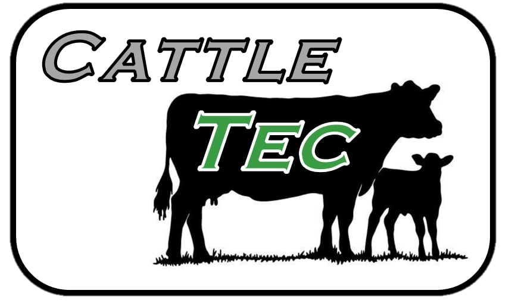
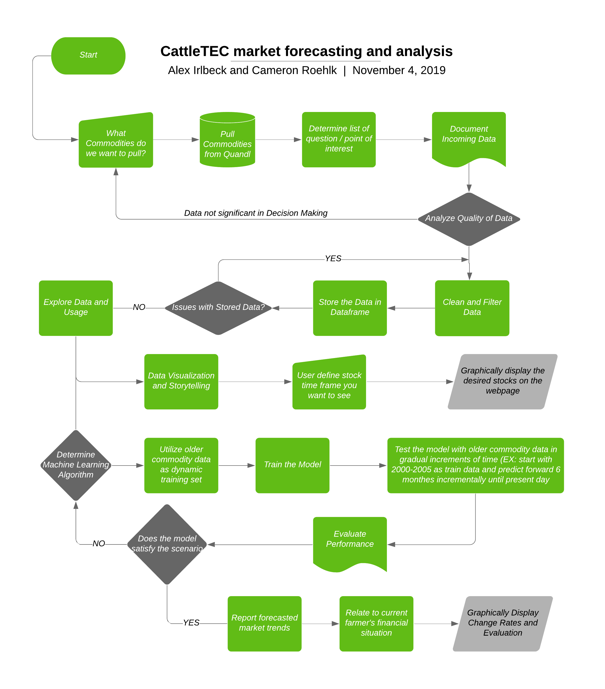

## Welcome to CattleTEC
CattleTEC market forecasting and analysis project. The goal of this project is to bring in commodity values that matter to cow / calf producters and display them in a quick and easy to understand format that allows the user to refine and select out what timeframe of the markets they would like to see. In addition, we are also developing a machine learning algorithm that will analyze the commodity trends from previous years in order to forecast out what the markets will do before they do it. This will hopefully give farmers a competitive advantage when marketing their animals.

### Project Workflow
Here is the layout of how we intend to accomplish our project for the rest of the duration of ABE 516X

